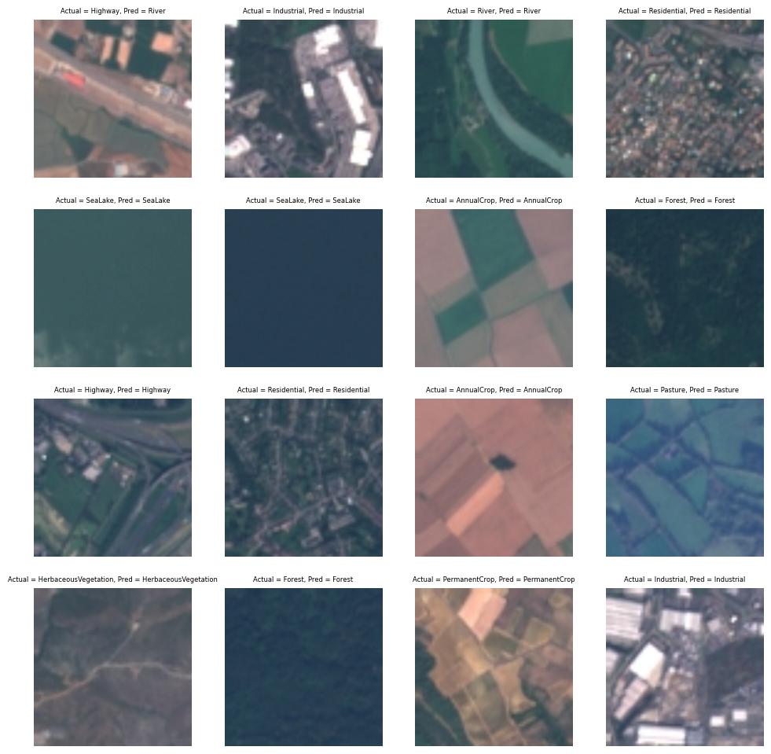

### About 
This repo is built on the tutorial : LULC classification using Deep learning https://github.com/climatechange-ai-tutorials/lulc-classification presented in Climate Change AI Summer School. 

The tutorial is a large flow, which I have tried to break down in smaller notebooks, with more description of each of the steps, for a better understanding for those new to pytorch (like me, who is learning pytorch in the process of working out these tutorials)

### Goal   
The goal of these set of notebooks is to build a Land Use Land Cover (LULC) model for EuroSAT data using a pretrained model (ResNet50). 

### EuroSAT:   

* Contains 27000 labeled geo-referenced images of Sentinel2 covering 13 spectral bands and 10 classes 

### ResNet50:     
* ResNet50 is a deep learning architecture from the ResNet family, and excel in image classification tasks. 
* Residual Networks are deep learning model architectures which have skip connections between layers, which help in mitigating vanishing gradient issue, enabling training of deeper neural networks.
* ResNet50 refers to a 50 layer ResNet architecture.

### Notebooks : 
1. [1_data_download.ipynb](https://github.com/Nirzaree/lulc_classification_using_deep_learning/blob/master/1_data_download.ipynb) : Download EuroSAT dataset, and do basic EDA and plotting.
2. [2_data_normalization_and_train_val_test_split.ipynb](https://github.com/Nirzaree/lulc_classification_using_deep_learning/blob/master/2_data_normalization_and_train_val_test_split.ipynb) : Load data, create train, val, test transforms, split data into train, val, test sets and apply the transforms and create data loader for each of the splits.
3. [3_build_model.ipynb](https://github.com/Nirzaree/lulc_classification_using_deep_learning/blob/master/3_build_model.ipynb) : Load train, val, test data loaders, load Resnet50 pretrained model and train the model for 10 epochs on the data. 
4. [4_exercise_1_no_finetuning.ipynb](https://github.com/Nirzaree/lulc_classification_using_deep_learning/blob/master/4_exercise_1_no_finetuning.ipynb) : What if we take ResNET model and directly run on the data without any fine tuning? 
5. [5_exercise_2_different_finetuning_strategy.ipynb](https://github.com/Nirzaree/lulc_classification_using_deep_learning/blob/master/5_exercise_2_different_finetuning_strategy.ipynb) : Instead of modifying all weights, only modify weights of the last layer. 
6. [6_exercise_3_different_pretrained_model.ipynb](https://github.com/Nirzaree/lulc_classification_using_deep_learning/blob/master/6_exercise_3_different_pretrained_model.ipynb) : Instead of Resnet50, we try 2 different models : EfficientNet and VGG19 and check the performance on the EuroSAT data. 

### Results
* Model : Resnet50,
* Epochs trained : 10,
* fine tuning:  all weights trainable

